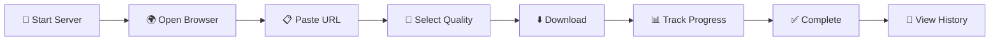

<div align="center" style="text-align:center">


<pre style="display:inline-block; text-align:left; margin:0">
  █████ █████ ███████████ ██████████   █████
▒▒███ ▒▒███ ▒█▒▒▒███▒▒▒█▒▒███▒▒▒▒███ ▒▒███
 ▒▒███ ███  ▒   ▒███  ▒  ▒███   ▒▒███ ▒███
  ▒▒█████       ▒███     ▒███    ▒███ ▒███
   ▒▒███        ▒███     ▒███    ▒███ ▒███
           ▒███        ▒███     ▒███    ███  ▒███      █
           █████       █████    ██████████   ███████████
               ▒▒▒▒▒       ▒▒▒▒▒    ▒▒▒▒▒▒▒▒▒▒   ▒▒▒▒▒▒▒▒▒▒▒       
</pre>

[](https://www.python.org/)
[](https://flask.palletsprojects.com/)
[](https://github.com/diorhc/YTDL)
[](LICENSE)

</div>

---

<div align="center">

### 📥 A modern, feature-rich YouTube downloader with a beautiful web interface and powerful command-line tools. Download videos up to 8K quality with intelligent fallback mechanisms and advanced error recovery. Yandex, Dzen, VK, Rutube - support

</div>

> **⚠️ Legal Notice**: This tool is for educational and personal use only. Please respect YouTube's Terms of Service and copyright laws. Only download content you have permission to download.

---

<div align="center">

### ✨ Key Features

<table>
<tr>
<td width="50%">

### 📹 High-Quality Downloads

- 🎯 **Up to 8K resolution** (7680x4320)
- 🎵 **Audio-only MP3** extraction
- 📊 Multiple quality options
- 🏷️ Metadata embedding

</td>
<td width="50%">

### 🎨 Modern Web Interface

- 🌓 **Dark/Light mode**
- 📱 Mobile-friendly responsive design
- 📊 Real-time progress tracking
- 📋 Download history & clipboard integration

</td>
</tr>
<tr>
<td width="50%">

### ⚡ Advanced Technology

- 🚀 **Dual-mode** (Ultra/Standard)
- 🔄 Intelligent error recovery
- 🛡️ Rate limiting protection
- 🧵 Multi-threaded downloads
- 🎬 FFmpeg integration

</td>
<td width="50%">

### �️ Reliability & Robustness

- 🔁 Multiple retry mechanisms
- 🍪 Cookie-based sessions
- 📦 Format fallback system
- 🏭 Production-ready WSGI server
- 🌍 **Multi-Platform Support**

</td>
</tr>
</table>

---

### 🚀 Quick Start

</div>

<table align="center">
<tr>
<td>
<details>
<summary><b>🖥️ Windows</b></summary>
<br>

```batch
# 1️⃣ Clone repository
git clone https://github.com/diorhc/YTDL.git
cd YTDL

# 2️⃣ Create desktop shortcut (PowerShell)
$desktop = "$env:USERPROFILE\Desktop"
if (-not (Test-Path $desktop)) {
    New-Item -ItemType Directory -Path $desktop | Out-Null
}
$WshShell = New-Object -comObject WScript.Shell
$Shortcut = $WshShell.CreateShortcut("$desktop\YTDL.lnk")
$Shortcut.TargetPath = "$(Resolve-Path 'launcher.bat')"
$Shortcut.WorkingDirectory = (Get-Location).Path
$Shortcut.Description = "YTDL Launcher"
$Shortcut.Save()
Write-Host "✅ Shortcut created on Desktop: YTDL.lnk"

# 3️⃣ Start application
"2`n1" | cmd /c launcher.bat
```

**🎉 Done! Open browser at [localhost:5005](http://localhost:5005)**
<br><br>

</details>
</td>
<td>
<details>
<summary><b>🐧 Linux / 🍎 macOS</b></summary>
<br>

```bash
# 1️⃣ Install prerequisites
sudo apt update
sudo apt install -y git curl

# 2️⃣ Clone repository
git clone https://github.com/diorhc/YTDL.git
cd YTDL

# 3️⃣ Make launcher executable
chmod +x launcher.sh

# 4️⃣ Start application
./launcher.sh
# Choose option 2 (Setup)
# Choose option 1 (Launch)
```

**📖 See [README_UNIX.md](README_UNIX.md)**
<br><br>

</details>
</td>
<td>
<details>
<summary><b>🤖 Android</b></summary>
<br>

> **📱 Install from [F-Droid](https://f-droid.org/packages/com.termux/)**

```bash
# 1️⃣ Update packages
pkg update -y && pkg upgrade -y

# 2️⃣ Clone repository
pkg install git -y
git clone https://github.com/diorhc/YTDL.git
cd YTDL

# 3️⃣ Make launcher executable
chmod +x launcher_termux.sh

# 4️⃣ Start application
./launcher_termux.sh
# Choose options 3, 4, 5, then 1
```

**📱 See [README_TERMUX.md](README_TERMUX.md)**
<br><br>

</details>
</td>
</tr>
</table>

---

<div align="center">

### 🌐 Web Interface Usage



</div>

<div align="center">

**1️⃣ Start the server** → **2️⃣ Open your browser** → **3️⃣ Paste YouTube URL** → **4️⃣ Select quality** → **5️⃣ Download** → **6️⃣ Access history**

**🌓 Theme Toggle** • **📋 Clipboard Integration** • **📊 Live Progress** • **📜 Download History** • **✂️ Trim Video** • **🎵 Audio Selection**

---

### 🖱️ Command Line Interface

</div>

<details>
<summary><b>📦 Basic Usage</b></summary>

<br>

```bash
# 🎯 Download best quality
python youtube_downloader.py "https://youtu.be/VIDEO_ID"

# 📺 Download specific quality
python youtube_downloader.py "https://youtu.be/VIDEO_ID" -q 1080p

# 🎵 Audio only download
python youtube_downloader.py "https://youtu.be/VIDEO_ID" --audio-only

# 📝 Custom filename
python youtube_downloader.py "https://youtu.be/VIDEO_ID" -o "My Custom Video"

# 📋 List available formats
python youtube_downloader.py "https://youtu.be/VIDEO_ID" --list-formats
```

</details>

<details>
<summary><b>⚡ Advanced Options</b></summary>

<br>

```bash
# 🚀 Ultra mode (separate video/audio streams for best quality)
python youtube_downloader.py "https://youtu.be/VIDEO_ID" --mode ultra -q 4k

# 📦 Standard mode (single stream)
python youtube_downloader.py "https://youtu.be/VIDEO_ID" --mode standard -q 1080p

# 📁 Custom download directory
python youtube_downloader.py "https://youtu.be/VIDEO_ID" --download-path "./my_videos/"

# 🔍 Show capabilities
python youtube_downloader.py --capabilities

# ✂️ Trim video (download specific segment)
python youtube_downloader.py "https://youtu.be/VIDEO_ID" --trim-start 00:01:30 --trim-end 00:05:45

# 🌐 Select audio language
python youtube_downloader.py "https://youtu.be/VIDEO_ID" --audio-language en
```

</details>

<div align="center">

### 🎛️ CLI Options Reference

| Option             | Short | Description                         |
| ------------------ | ----- | ----------------------------------- |
| `--quality`        | `-q`  | Video quality (e.g., 1080p, 4k, 8k) |
| `--audio-only`     | `-a`  | Download audio only (MP3)           |
| `--output`         | `-o`  | Custom filename                     |
| `--mode`           | `-m`  | Download mode (ultra/standard)      |
| `--list-formats`   | `-l`  | List all available formats          |
| `--download-path`  |       | Custom download directory           |
| `--trim-start`     |       | Start time for trimming (HH:MM:SS)  |
| `--trim-end`       |       | End time for trimming (HH:MM:SS)    |
| `--audio-language` |       | Select audio track language         |

</div>

---

<div align="center">

### 🏗️ Project Structure

</div>

```
📦 YTDL/
├── 🎬 youtube_downloader.py     # Core download engine
├── 🌐 web_app.py                # Flask web application
├── 🧪 test_quality_fix.py       # Quality detection
├── ⚙️ config.py                 # Centralized configuration
├── 🚀 launcher.bat              # Windows launcher
├── 🐧 launcher.sh               # Mac/Linux launcher (chmod +x required)
├── 🤖 launcher_termux.sh        # Android/Termux launcher (chmod +x required)
├── ⚙️ setup_termux.sh           # Quick setup for Termux
├── 📋 requirements.txt          # Python dependencies
├── 📄 LICENSE                   # MIT license
├── 📖 README.md                 # Main documentation
├── 📘 README_UNIX.md            # Mac/Linux installation guide
├── 📗 README_TERMUX.md          # Android/Termux installation guide
│
├── 📁 templates/
│   └── 🎨 index.html            # Web interface template
│
└── 📁 downloads/                # Downloaded videos (auto-created)
```

---

<div align="center">

### 🛠️ Configuration

</div>

<details>
<summary><b>🌍 Environment Variables</b></summary>

<br>

Create a `.env` file for custom configuration:

```env
# Server Configuration
FLASK_HOST=0.0.0.0
FLASK_PORT=5005
FLASK_DEBUG=False

# Download Settings
DEFAULT_QUALITY=1080p
DOWNLOAD_PATH=./downloads/
MAX_RETRIES=3

# Advanced Options
ENABLE_COOKIES=True
USER_AGENT=Custom User Agent
AUTO_UPDATE_REQUIREMENTS=1
AUTO_UPDATE_DRY_RUN=1
```

</details>

<details>
<summary><b>⚙️ Custom Settings</b></summary>

<br>

Edit `web_app.py` for advanced customization:

```python
# Download directory
DOWNLOAD_DIR = "D:/MyVideos/"

# Server configuration
HOST = "0.0.0.0"  # Listen on all network interfaces
PORT = 8080       # Custom port

# Performance settings
MAX_CONCURRENT_DOWNLOADS = 3
CHUNK_SIZE = 1024 * 1024  # 1MB chunks
```

</details>

<details>
<summary><b>🔄 Auto-update Requirements</b></summary>

<br>

On startup, the launcher automatically checks and updates `requirements.txt`:

- **Disable auto-checks**: Set `AUTO_UPDATE_REQUIREMENTS=0`
- **Force real write**: Set `AUTO_UPDATE_DRY_RUN=0`
- **CLI flag**: Pass `--no-auto-update` when starting

The launcher's "Update" option (option 4) checks for outdated packages and offers automatic upgrades.

</details>

---

<div align="center">

### 🐛 Troubleshooting

| 🔴 Problem               | ✅ Solution                                             |
| ------------------------ | ------------------------------------------------------- |
| `ModuleNotFoundError`    | Run `pip install -r requirements.txt`                   |
| Web server won't start   | Check if port 5005 is in use, try another port          |
| Download fails           | Update yt-dlp: `pip install --upgrade yt-dlp`           |
| No audio in video        | Install FFmpeg and ensure it's in PATH                  |
| 403 Forbidden errors     | Tool retries automatically with exponential backoff     |
| Slow downloads           | Check internet connection; YouTube may be rate limiting |
| SSL certificate errors   | Enable "Insecure SSL" option in web interface           |
| Trim feature not working | Ensure FFmpeg is installed and accessible               |

</div>

<details>
<summary><b>🔍 Debug Mode</b></summary>

<br>

Enable detailed logging for troubleshooting:

```bash
# Start with debug mode
python web_app.py --debug

# Check logs
cat download.log
```

</details>

<details>
<summary><b>🔄 Updating yt-dlp</b></summary>

<br>

Keep yt-dlp up to date for best compatibility:

```bash
# Update via pip
pip install --upgrade yt-dlp

# Update yt-dlp directly
yt-dlp -U
```

</details>

<details>
<summary><b>🛡️ FFmpeg Installation</b></summary>

<br>

**Windows:**

```batch
# Download from https://ffmpeg.org/download.html
# Add to PATH environment variable
```

**Linux/macOS:**

```bash
# Ubuntu/Debian
sudo apt install ffmpeg

# macOS (Homebrew)
brew install ffmpeg
```

**Android (Termux):**

```bash
pkg install ffmpeg
```

</details>

---

<div align="center">

### 🔒 Security & Privacy

<table>
<tr>
<td align="center" width="25%">
<br>
🔐<br><br>
<b>No Data Collection</b><br>
All processing is local
</td>
<td align="center" width="25%">
<br>
📦<br><br>
<b>Self-Contained</b><br>
No external dependencies
</td>
<td align="center" width="25%">
<br>
✅<br><br>
<b>Safe Downloads</b><br>
Validates URLs & file types
</td>
<td align="center" width="25%">
<br>
🛡️<br><br>
<b>Hardened Security</b><br>
SSRF, XSS & Path Traversal protected
</td>
</tr>
</table>

</div>

---

<div align="center">

### 🤝 Contributing

</div>

<details>
<summary><b>📝 Contribution Guidelines</b></summary>

<br>

1. **🍴 Fork the repository**
2. **🌿 Create a feature branch:**
   ```bash
   git checkout -b feature/amazing-feature
   ```
3. **✨ Make your changes** (follow code style)
4. **🧪 Add tests** for new functionality
5. **💾 Commit your changes:**
   ```bash
   git commit -m 'Add amazing feature'
   ```
6. **📤 Push to the branch:**
   ```bash
   git push origin feature/amazing-feature
   ```
7. **🔀 Open a Pull Request**

</details>

<details>
<summary><b>🔧 Development Setup</b></summary>

<br>

```bash
# Clone repository
git clone https://github.com/diorhc/YTDL.git
cd YTDL

# Install dependencies
pip install -r requirements.txt

# Install development tools
pip install pytest black flake8 mypy

# Run tests
python -m pytest

# Format code
black *.py

# Lint code
flake8 *.py

# Type checking
mypy *.py
```

</details>

<details>
<summary><b>📋 Code Style</b></summary>

<br>

- Follow PEP 8 guidelines
- Use meaningful variable names
- Add docstrings to functions/classes
- Keep functions focused and small
- Write unit tests for new features

</details>

<br>

---

<div align="center">

### 📚 Platform-Specific Guides

|    Platform    |      Quick Start       |          Full Documentation          |
| :------------: | :--------------------: | :----------------------------------: |
| 🖥️ **Windows** |   Run `launcher.bat`   |        [README.md](README.md)        |
|  🐧 **Linux**  |    `./launcher.sh`     |   [README_UNIX.md](README_UNIX.md)   |
|  🍎 **macOS**  |    `./launcher.sh`     |   [README_UNIX.md](README_UNIX.md)   |
| 🤖 **Android** | `./launcher_termux.sh` | [README_TERMUX.md](README_TERMUX.md) |

</div>

---

<div align="center">

**Built with amazing open-source projects:**

<p align="center">
   <a href="https://github.com/yt-dlp/yt-dlp">
      
   </a>
   &nbsp;&nbsp;
   <a href="https://flask.palletsprojects.com/">
      
   </a>
   &nbsp;&nbsp;
   <a href="https://ffmpeg.org/">
      
   </a>
   &nbsp;&nbsp;
   <a href="https://zulko.github.io/moviepy/">
      
   </a>
</p>

</div>

---

<div align="center">

<table>
<tr>
<td align="center" width="33%">
<br>
🐛<br><br>
<b><a href="https://github.com/diorhc/YouTube-Downloader/issues">Report Issues</a></b><br>
Found a bug? Let us know!
<br><br>
</td>
<td align="center" width="33%">
<br>
💬<br><br>
<b><a href="https://github.com/diorhc/YouTube-Downloader/discussions">Discussions</a></b><br>
Questions or ideas? Join the conversation!
<br><br>
</td>
<td align="center" width="33%">
<br>
📖<br><br>
<b>Documentation</b><br>
Check README & inline comments
<br><br>
</td>
</tr>
</table>

</div>

<div align="center">


### 🎬 Made with ❤️ for the YouTube downloading community

⭐ Star this repository if you find it useful!

</div>
