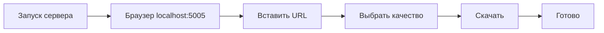

<div align="center">


# YTDL v2

[](https://www.python.org/)
[](https://flask.palletsprojects.com/)
[](https://github.com/diorhc/YTDL)
[](LICENSE)

**Простой и мощный загрузчик видео с веб-интерфейсом.**
Скачивайте видео до 8K с YouTube, VK, Dzen, Rutube, Instagram, TikTok и других платформ.

</div>

---

## ✨ Возможности

|                                                           |                                                               |
| --------------------------------------------------------- | ------------------------------------------------------------- |
| **📹 Загрузка видео** — до 8K, аудио MP3, метаданные      | **🌐 Веб-интерфейс** — тёмная/светлая тема, прогресс, история |
| **⚡ Два режима** — Ultra (раздельные потоки) и Standard  | **✂️ Обрезка видео** — по времени через FFmpeg                |
| **🔄 Автовосстановление** — повторы при 403, SSL fallback | **🌍 Мультиплатформа** — Windows, macOS, Linux, Android       |

---

## 📥 Установка

> **Важно:** Не используйте `git clone` — скачивайте готовый релиз со страницы Releases.

### 🖥️ Windows

1. Перейдите на страницу [**Releases**](https://github.com/diorhc/YTDL/releases)
2. Скачайте **`YTDL-v2-windows.zip`**
3. Распакуйте архив в любую папку
4. Запустите **`launcher.bat`**
5. Выберите пункт **2 (Setup)** — установятся Python, FFmpeg и зависимости
6. Выберите пункт **1 (Web Interface)** → откроется браузер на [localhost:5005](http://localhost:5005)

<details>
<summary>Создать ярлык на рабочем столе (PowerShell)</summary>

```powershell
$desktop = "$env:USERPROFILE\Desktop"
$WshShell = New-Object -comObject WScript.Shell
$Shortcut = $WshShell.CreateShortcut("$desktop\YTDL.lnk")
$Shortcut.TargetPath = "$(Resolve-Path 'launcher.bat')"
$Shortcut.WorkingDirectory = (Get-Location).Path
$Shortcut.Description = "YTDL Launcher"
$Shortcut.Save()
```

</details>

### 🐧 Linux / 🍎 macOS

1. Перейдите на страницу [**Releases**](https://github.com/diorhc/YTDL/releases)
2. Скачайте **`YTDL-v2-unix.tar.gz`**
3. Распакуйте и запустите:

```bash
tar -xzf YTDL-v2-unix.tar.gz
cd YTDL-v2
chmod +x launcher.sh
./launcher.sh
# Выберите 2 (Setup), затем 1 (Launch)
```

> 📖 Подробнее: [README_UNIX.md](README_UNIX.md)

### 🤖 Android (Termux)

1. Установите [**Termux**](https://f-droid.org/packages/com.termux/) из F-Droid (не из Google Play!)
2. В Termux:

```bash
pkg update -y && pkg upgrade -y
pkg install -y wget tar
cd ~
# Скачайте YTDL-v2-unix.tar.gz со страницы Releases:
# https://github.com/diorhc/YTDL/releases
wget https://github.com/diorhc/YTDL/releases/latest/download/YTDL-v2-unix.tar.gz
tar -xzf YTDL-v2-unix.tar.gz
cd YTDL-v2
chmod +x launcher_termux.sh setup_termux.sh
./launcher_termux.sh
# Выберите 3 → 4 → 5 (установка), затем 1 (запуск)
```

> 📖 Подробнее: [README_TERMUX.md](README_TERMUX.md)

---

## 🌐 Использование — Веб-интерфейс



1. Запустите сервер через лаунчер
2. Откройте браузер → [localhost:5005](http://localhost:5005)
3. Вставьте ссылку на видео
4. Выберите качество и нажмите «Скачать»

**Доступно:** переключение темы, обрезка видео, выбор аудиодорожки, история загрузок, прогресс в реальном времени

---

## 🖱️ Использование — Командная строка

```bash
# Лучшее качество
python youtube_downloader.py "https://youtu.be/VIDEO_ID"

# Конкретное качество
python youtube_downloader.py "https://youtu.be/VIDEO_ID" -q 1080p

# Только аудио
python youtube_downloader.py "https://youtu.be/VIDEO_ID" --audio-only

# Своё имя файла
python youtube_downloader.py "https://youtu.be/VIDEO_ID" -o "Моё видео"

# Ultra режим (раздельные потоки, лучшее качество)
python youtube_downloader.py "https://youtu.be/VIDEO_ID" -m ultra -q 4k

# Обрезка видео (с 1:30 до 5:45)
python youtube_downloader.py "https://youtu.be/VIDEO_ID" --trim-start 90 --trim-end 345

# Выбор языка аудио
python youtube_downloader.py "https://youtu.be/VIDEO_ID" --audio-language ru

# Список форматов
python youtube_downloader.py "https://youtu.be/VIDEO_ID" --list-formats

# Показать возможности
python youtube_downloader.py --capabilities
```

### Параметры CLI

| Параметр           | Сокр. | Описание                                                                         |
| ------------------ | ----- | -------------------------------------------------------------------------------- |
| `--quality`        | `-q`  | Качество: `best`, `4k`, `1440p`, `1080p`, `720p`, `480p`, `360p`, `240p`, `144p` |
| `--mode`           | `-m`  | Режим: `auto`, `ultra`, `standard`                                               |
| `--output`         | `-o`  | Имя выходного файла                                                              |
| `--download-path`  | `-d`  | Папка для загрузок                                                               |
| `--audio-only`     |       | Только аудио (MP3)                                                               |
| `--trim-start`     |       | Начало обрезки (секунды)                                                         |
| `--trim-end`       |       | Конец обрезки (секунды)                                                          |
| `--audio-language` |       | Код языка аудио (en, ru)                                                         |
| `--list-formats`   |       | Показать доступные форматы                                                       |
| `--insecure-ssl`   |       | Отключить проверку SSL                                                           |
| `--capabilities`   |       | Показать возможности загрузчика                                                  |

---

## 📁 Структура проекта

```
YTDL-v2/
├── youtube_downloader.py   # Движок загрузки
├── web_app.py              # Flask веб-приложение
├── config.py               # Настройки
├── test_quality_fix.py     # Тесты качества
├── launcher.bat            # Лаунчер Windows
├── launcher.sh             # Лаунчер Linux/macOS
├── launcher_termux.sh      # Лаунчер Android/Termux
├── setup_termux.sh         # Быстрая установка Termux
├── requirements.txt        # Зависимости Python
├── templates/
│   └── index.html          # Веб-интерфейс
└── downloads/              # Загруженные файлы (создаётся автоматически)
```

---

## ⚙️ Настройка

Переменные окружения (необязательно):

| Переменная         | По умолчанию  | Описание                           |
| ------------------ | ------------- | ---------------------------------- |
| `FLASK_HOST`       | `0.0.0.0`     | Адрес сервера                      |
| `FLASK_PORT`       | `5005`        | Порт сервера                       |
| `DOWNLOAD_PATH`    | `./downloads` | Папка загрузок                     |
| `DEFAULT_QUALITY`  | `best`        | Качество по умолчанию              |
| `DEBUG_MODE`       | `false`       | Режим отладки                      |
| `INSECURE_SSL`     | `false`       | Пропуск проверки SSL               |
| `FLASK_SECRET_KEY` | (авто)        | Секретный ключ Flask               |
| `USE_WAITRESS`     | `0`           | Использовать Waitress (production) |

---

## 🐛 Решение проблем

| Проблема                    | Решение                                                          |
| --------------------------- | ---------------------------------------------------------------- |
| `ModuleNotFoundError`       | Запустите Setup в лаунчере или `pip install -r requirements.txt` |
| Не стартует сервер          | Проверьте, свободен ли порт 5005                                 |
| Ошибка загрузки             | Обновите yt-dlp: `pip install --upgrade yt-dlp`                  |
| Нет звука в видео           | Установите FFmpeg                                                |
| 403 Forbidden               | Автоматические повторы; попробуйте позже                         |
| Ошибка SSL                  | Включите «Insecure SSL» в интерфейсе или `--insecure-ssl`        |
| Обрезка не работает         | Убедитесь, что FFmpeg установлен                                 |
| Низкое качество (макс 360p) | Установите FFmpeg для раздельных потоков                         |

<details>
<summary><b>Установка FFmpeg</b></summary>

- **Windows:** Автоматически через лаунчер (Setup) или вручную с [ffmpeg.org](https://ffmpeg.org/download.html)
- **macOS:** `brew install ffmpeg`
- **Linux:** `sudo apt install ffmpeg`
- **Termux:** `pkg install ffmpeg`

</details>

---

## 🔒 Безопасность

- Все данные обрабатываются локально — никакой телеметрии
- Защита от Path Traversal, SSRF, XSS, Command Injection
- Валидация URL и файловых путей
- Rate limiting на API-эндпоинтах
- CSP-заголовки безопасности

> Подробнее: [SECURITY.md](SECURITY.md)

---

## 🤝 Участие в проекте

1. Форкните репозиторий
2. Создайте ветку: `git checkout -b feature/my-feature`
3. Внесите изменения и добавьте тесты
4. Отправьте PR

---

<div align="center">

**Используемые технологии:**

[](https://github.com/yt-dlp/yt-dlp)
[](https://flask.palletsprojects.com/)
[](https://ffmpeg.org/)
[](https://zulko.github.io/moviepy/)


⭐ Поставьте звезду, если проект полезен!

[🐛 Сообщить об ошибке](https://github.com/diorhc/YTDL/issues) · [💬 Обсуждения](https://github.com/diorhc/YTDL/discussions) · [⬅️ К корню проекта](../README.md)

</div>
